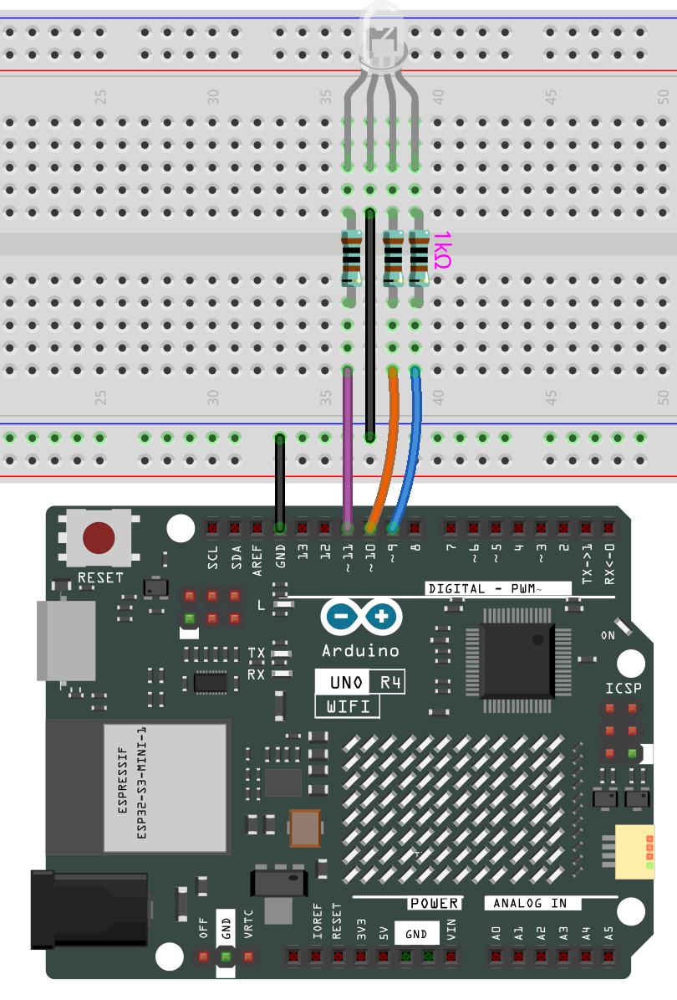

# RGB LED

## Overview

In this lesson, we will use PWM to control an RGB LED to flash various kinds of color. When different PWM values are set to the R, G, and B pins of the LED, its brightness will be different. When the three different colors are mixed, we can see that the RGB LED flashes different colors.

## PWM

Pulse width modulation, or PWM, is a technique for getting analog results with digital means. Digital control is used to create a square wave, a signal switched between on and off. This on-off pattern can simulate voltages in between full on (5 Volts) and off (0 Volts) by changing the portion of the time the signal spends on versus the time that the signal spends off. The duration of “on time” is called pulse width. To get varying analog values, you change, or modulate, that width. If you repeat this on-off pattern fast enough with some device, an LED for example, it would be like this: the signal is a steady voltage between 0 and 5V controlling the brightness of the LED. (See the PWM description on the official website of Arduino).

In the graphic below, the green lines represent a regular time period. This duration or period is the inverse of the PWM frequency. In other words, with Arduino’s PWM frequency at about 500Hz, the green lines would measure 2 milliseconds each.

A call to analogWrite() is on a scale of 0 - 255, such that analogWrite(255) requests a 100% duty cycle (always on), and analogWrite(127) is a 50% duty cycle (on half the time) for example.

You will find that the smaller the PWM value is, the smaller the value will be after being converted into voltage. Then the LED becomes dimmer accordingly. Therefore, we can control the brightness of the LED by controlling the PWM value.

## Wiring



## Code

> **Note:**
>
> * You can open the file `11-rgb_led.ino` under the path of `elite-explorer-kit-main\basic_project\10-led`.

Once the code is successfully uploaded, you will observe the RGB LED flashing in a circular pattern of red, green, and blue initially. It will then proceed to flash in the sequence of red, orange, yellow, green, blue, indigo, and purple.

## Code Analysis

**Set the color**

Here use the `color()` function to set the color of the RGB LED. In the code, it is set to flash 7 different colors.

You can use the paint tool on your computer to get the RGB value.

1. Open the paint tool on your computer and click to Edit colors.
   
2. Select one color, then you can see the RGB value of this color. Fill them in the code.
   Note

   Due to hardware and environmental factors, the colors displayed on computer screens and RGB LEDs may vary even when using the same RGB values.

   

   ```cpp
   void loop() // run over and over again

   {

     // Basic colors:

     color(255, 0, 0); // turn the RGB LED red

     delay(1000); // delay for 1 second

     color(0,255, 0); // turn the RGB LED green

     delay(1000); // delay for 1 second

     color(0, 0, 255); // turn the RGB LED blue

     delay(1000); // delay for 1 second

     // Example blended colors:

     color(255,0,252); // turn the RGB LED red

     delay(1000); // delay for 1 second

     color(237,109,0); // turn the RGB LED orange

     delay(1000); // delay for 1 second

     color(255,215,0); // turn the RGB LED yellow

     ......
   ```

**color() function**

```cpp
void color (int red, int green, int blue)
// the color generating function

{

  analogWrite(redPin, red);

  analogWrite(greenPin, green);

  analogWrite(bluePin, blue);

}
```

Define three unsigned char variables, red, green and blue. Write their values to `<span class="pre">redPin</span>`, `<span class="pre">greenPin</span>` and `<span class="pre">bluePin</span>`. For example, color(128,0,128) is to write 128 to `<span class="pre">redPin</span>`, 0 to `<span class="pre">greenPin</span>` and 128 to `<span class="pre">bluePin</span>`. Then the result is the LED flashing purple.

**analogWrite()** : Writes an analog value (PWM wave) to a pin. It has nothing to do with an analog pin, but is just for PWM pins. You do not need to call the `<span class="pre">pinMode()</span>` to set the pin as output before calling `<span class="pre">analogWrite()</span>`.
